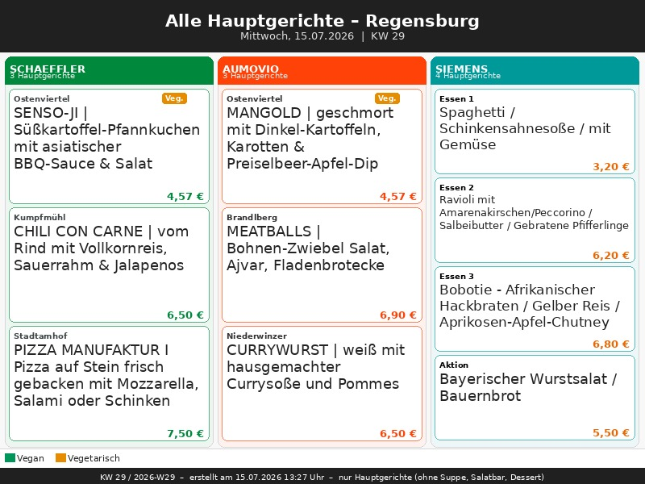
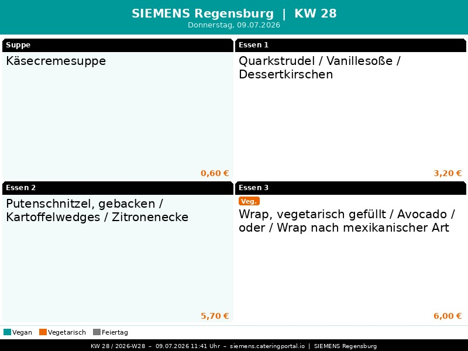

# Kantinen-Photoframe Regensburg

[](https://github.com/basecore/eurest-kantine-photoframe/actions/workflows/update-menus.yml)
[](https://basecore.github.io/eurest-kantine-photoframe/)
[](https://www.python.org/)
[](https://github.com/basecore/eurest-kantine-photoframe/commits/main)

> Automatische Speiseplan-Screenshots für den **Philips 8FF3WMI Bilderrahmen** (800 × 600 px).  
> Unterstützte Kantinen:
>
> - **[SCHAEFFLER Regensburg](https://eurest.webspeiseplan.de/menu/8949)**
> - **[AUMOVIO Regensburg](https://eurest.webspeiseplan.de/menu/8950)**
> - **[SIEMENS Regensburg](https://siemens.cateringportal.io/menu/Regensburg/Mittagessen)**

---

## Was macht dieses Projekt?

Dieses Repository erzeugt automatisch aktuelle **800 × 600 JPEG-Speisepläne** für digitale Bilderrahmen, GitHub Pages und RSS-/PhotoFrame-Feeds.

Der Ablauf ist:

1. **Scrapen**
   - **SCHAEFFLER** und **AUMOVIO** werden über `eurest.webspeiseplan.de` geladen.
   - **SIEMENS** wird über `siemens.cateringportal.io` geladen.

2. **Rendern**
   - Ausgabe als **800 × 600 JPEG**
   - **Tagesansicht als Standard**
   - **Wochenansicht optional**

3. **Feeds erzeugen**
   - RSS-/PhotoFrame-Feeds auf Basis der aktuellen Manifest-Dateien

4. **GitHub Actions**
   - Vollautomatische Aktualisierung per Workflow

---

## Aktuelle Bilder

### Alle Kantinen (Übersicht)


### [SCHAEFFLER Regensburg](https://eurest.webspeiseplan.de/menu/8949)


### [AUMOVIO Regensburg](https://eurest.webspeiseplan.de/menu/8950)


### [SIEMENS Regensburg](https://siemens.cateringportal.io/menu/Regensburg/Mittagessen)


---

## Hardware

| Philips 8FF3WMI Bilderrahmen | TP-Link Router (WLAN) |
|:---:|:---:|
|  |  |

- **Bilderrahmen:** Philips 8FF3WMI, 800 × 600 px, RSS-Feed-Unterstützung
- **Netzwerk:** Der Rahmen hängt per WLAN am TP-Link Router
- **Aktualisierung:** Die Bilder werden automatisch über GitHub Actions aktualisiert

---

## Features

### Allgemein
- **Tagesansicht als Standard**
- **Wochenansicht optional**
- manueller Zieltag per `DISPLAY_DAY`
- automatische Umschaltung:
  - **vor 13:30 Uhr** → heutiger Werktag
  - **ab 13:30 Uhr** → nächster Werktag
- Ausgabe als **JPEG 800 × 600**
- Speicherung von:
  - `latest_<location>.jpg`
  - `current_<location>.json`
  - historischen Bildern `kantine_<...>.jpg`

### SCHAEFFLER & AUMOVIO
- Scraping über Eurest / Webspeiseplan
- robuster Mehrfach-Fallback:
  - DOM
  - Netzwerk-/JSON
  - PDF
- **Tagesansicht**
- **Wochenansicht**
- kantinenspezifische Corporate-Themes:
  - **Schaeffler:** Grün / Anthrazit
  - **Aumovio:** Orange / Dunkelgrau
- dynamische Kategorien direkt aus dem DOM, z. B.:
  - Suppe
  - Ostenviertel
  - Kumpfmühl / Weichs / Brandlberg / Niederwinzer / Königswiesen
  - Salatbar
  - Dessert

### SIEMENS
- Scraping über Siemens CateringPortal
- **Tagesansicht standardmäßig**
- **Wochenansicht optional**
- Siemens-Farben:
  - **Petrol** `#009999`
  - **Schwarz**
  - **Weiß**
  - **Healthy Orange** `#EC6602`
- feste Kategorien:
  - `Suppe`
  - `Essen 1`
  - `Essen 2`
  - `Essen 3`
  - `Aktion`
- **Update:** Für die Siemens-Kantine wird jetzt zusätzlich versucht, auch vegetarische Gerichte zu markieren, wenn im CateringPortal selbst keine eindeutige Kennzeichnung vorhanden ist.

### Darstellung
- Vegan-/Vegetarisch-Badges
- Feiertagserkennung (Bayern)
- Hervorhebung von **Heute**
- Kennzeichnung vergangener Tage
- Preisanzeige pro Gericht
- einheitliche Rendergröße für den Bilderrahmen
- Siemens zusätzlich mit fester 4-Kachel-Tageslogik

### Output / Persistenz
- `latest_<location>.jpg` für den jeweils aktuellen Stand
- `current_<location>.json` als Manifest
- historische Bilder mit Datum / KW
- RSS-/Feed-Erzeugung aus den Manifest-Dateien
- Cache-Busting der Bild-URLs über `?v=<timestamp>`

---

## Ansichtslogik

### Tagesansicht (`DISPLAY_MODE=day`)
Standardmodus für alle drei Kantinen.

Automatik:
- **vor 13:30 Uhr** → heutiger Werktag
- **ab 13:30 Uhr** → nächster Werktag

Optional kann ein fixer Zieltag gesetzt werden:

```bash
DISPLAY_DAY=monday
DISPLAY_DAY=tuesday
DISPLAY_DAY=wednesday
DISPLAY_DAY=thursday
DISPLAY_DAY=friday
```

### Wochenansicht (`DISPLAY_MODE=week`)
- zeigt Montag bis Freitag
- `WEEK_OFFSET=0` → aktuelle Woche
- `WEEK_OFFSET=1` → nächste Woche

---

## Automatischer Workflow

Empfohlener Hauptworkflow:

- **`.github/workflows/update-menus.yml`**

Dieser Workflow:

1. installiert die Abhängigkeiten
2. ruft `python scripts/generate_all.py` auf
3. erzeugt danach RSS-/Feed-Dateien
4. committed die aktualisierten Dateien unter `docs/`

### Workflow-Inputs
- `display_mode`
- `display_day`
- `week_offset`
- `only`

### Beispiele
- alle Menüs in Tagesansicht
- nur Siemens
- nur Schaeffler + Aumovio
- Wochenansicht
- fixer Zieltag

---

## Automatischer Zeitplan

| Zeitpunkt | UTC | Aktion |
|-----------|-----|--------|
| Werktags Mo–Fr | 04:00 | `Update Menus` Workflow läuft automatisch |
| Manuell | jederzeit | `workflow_dispatch` mit `display_mode`, `display_day`, `week_offset`, `only` |

> **Hinweis:** GitHub Actions Cron läuft in UTC. In Deutschland entspricht das je nach Sommer-/Winterzeit typischerweise **06:00 Uhr CEST** bzw. **05:00 Uhr CET**.

---

## Verzeichnisstruktur

```text
.github/
  workflows/
    update-menus.yml                 # Hauptworkflow

scripts/
  take_screenshot_eurest.py          # Eurest: Schaeffler + Aumovio
  take_screenshot_siemens.py         # Siemens
  generate_all.py                    # Orchestrator für alle drei Menüs
  generate_rss.py                    # RSS-/Feed-Erzeugung

docs/
  images/
    latest_all_main.jpg
    latest_schaeffler.jpg
    latest_aumovio.jpg
    latest_siemens.jpg

    current_schaeffler.json
    current_aumovio.json
    current_siemens.json

    kantine_*.jpg

  feed_schaeffler.xml
  feed_schaeffler.php
  feed_aumovio.xml
  feed_aumovio.php
  feed_siemens.xml
  feed_siemens.php

  index.html

sources/
  IMG/
    .gitkeep
```

---

## RSS-Feed für den Bilderrahmen

Der Bilderrahmen (Philips 8FF3WMI) kann RSS-Feeds mit Bildern abonnieren.

### SCHAEFFLER Regensburg

**Kantine direkt öffnen:**  
[https://eurest.webspeiseplan.de/menu/8949](https://eurest.webspeiseplan.de/menu/8949)

**Feed-URL (HTTPS / GitHub Pages):**
```text
https://basecore.github.io/eurest-kantine-photoframe/feed_schaeffler.xml
```

**Feed-URL (HTTP, bplaced – kein Cache):**
```text
http://basecore.bplaced.net/eurest/feed_schaeffler.php
```

**Direktes Bild:**
```text
https://basecore.github.io/eurest-kantine-photoframe/images/latest_schaeffler.jpg
```

---

### AUMOVIO Regensburg

**Kantine direkt öffnen:**  
[https://eurest.webspeiseplan.de/menu/8950](https://eurest.webspeiseplan.de/menu/8950)

**Feed-URL (HTTPS / GitHub Pages):**
```text
https://basecore.github.io/eurest-kantine-photoframe/feed_aumovio.xml
```

**Feed-URL (HTTP, bplaced – kein Cache):**
```text
http://basecore.bplaced.net/eurest/feed_aumovio.php
```

**Direktes Bild:**
```text
https://basecore.github.io/eurest-kantine-photoframe/images/latest_aumovio.jpg
```

---

### SIEMENS Regensburg

**Kantine direkt öffnen:**  
[https://siemens.cateringportal.io/menu/Regensburg/Mittagessen](https://siemens.cateringportal.io/menu/Regensburg/Mittagessen)

**Feed-URL (HTTPS / GitHub Pages):**
```text
https://basecore.github.io/eurest-kantine-photoframe/feed_siemens.xml
```

**Feed-URL (HTTP, bplaced – kein Cache):**
```text
http://basecore.bplaced.net/eurest/feed_siemens.php
```

**Direktes Bild:**
```text
https://basecore.github.io/eurest-kantine-photoframe/images/latest_siemens.jpg
```

---

## Lokale Ausführung

### Voraussetzungen

```bash
python -m pip install --upgrade pip
pip install pillow playwright pypdf
python -m playwright install --with-deps chromium
```

Optional unter Linux zusätzlich Schriftarten:
```bash
sudo apt-get install -y fonts-dejavu fonts-liberation
```

### Alle drei Menüs erzeugen
```bash
python scripts/generate_all.py
```

### Nur Siemens erzeugen
```bash
ONLY=siemens python scripts/generate_all.py
```

### Nur Schaeffler und Aumovio
```bash
ONLY=schaeffler,aumovio python scripts/generate_all.py
```

### Wochenansicht für alle
```bash
DISPLAY_MODE=week WEEK_OFFSET=1 python scripts/generate_all.py
```

### Tagesansicht auf fixen Tag setzen
```bash
DISPLAY_MODE=day DISPLAY_DAY=wednesday python scripts/generate_all.py
```

### RSS-/Feed-Dateien erzeugen
```bash
python scripts/generate_rss.py
```

---

## Einzelaufrufe

### SCHAEFFLER
```bash
EUREST_LOCATION_ID=8949 EUREST_LOCATION_NAME=schaeffler python scripts/take_screenshot_eurest.py
```

### AUMOVIO
```bash
EUREST_LOCATION_ID=8950 EUREST_LOCATION_NAME=aumovio python scripts/take_screenshot_eurest.py
```

### SIEMENS
```bash
python scripts/take_screenshot_siemens.py
```

### Aktuelle Woche erzwingen
```bash
WEEK_OFFSET=0 EUREST_LOCATION_ID=8949 EUREST_LOCATION_NAME=schaeffler python scripts/take_screenshot_eurest.py
```

### Siemens Wochenansicht
```bash
DISPLAY_MODE=week WEEK_OFFSET=1 python scripts/take_screenshot_siemens.py
```

---

## Umgebungsvariablen

### Gemeinsame Variablen

| Variable | Standard | Beschreibung |
|---|---|---|
| `DISPLAY_MODE` | `day` | `day` oder `week` |
| `DISPLAY_DAY` | leer | Optional fixer Wochentag |
| `WEEK_OFFSET` | `0` für day / `1` für week | aktuelle oder nächste Woche |
| `ONLY` | leer | optionaler Filter für `generate_all.py` |

### Eurest

| Variable | Standard | Beschreibung |
|---|---|---|
| `EUREST_LOCATION_ID` | `8949` | `8949` = Schaeffler, `8950` = Aumovio |
| `EUREST_LOCATION_NAME` | `schaeffler` | Kurzname für Dateinamen |

### Siemens

| Variable | Standard | Beschreibung |
|---|---|---|
| `CATERINGPORTAL_URL` | Siemens Regensburg Mittagessen | Basis-URL für Siemens |
| `CATERINGPORTAL_SID` | leer | optionale Session-ID |
| `DISPLAY_MODE` | `day` | Tagesansicht als Standard |
| `DISPLAY_DAY` | leer | optional fixer Wochentag |

---

## GitHub Pages aktivieren

```text
Settings → Pages → Source: Deploy from branch → main → /docs
```

Danach erreichbar unter:

```text
https://basecore.github.io/eurest-kantine-photoframe/
```

---

## Technische Details

### Eurest
Die Eurest-Seite benötigt einen mehrstufigen Initialisierungsflow:

1. Mandanten-URL öffnen
2. Kantine auswählen
3. Privacy-Policy bestätigen
4. Sprache auf Deutsch setzen
5. Optionales Filter-Modal schließen
6. Tagesdaten extrahieren

Fallbacks:
- DOM
- Netzwerk-/JSON
- PDF

### Siemens
Die Siemens-Seite wird direkt datumsbezogen geladen und über DOM-Strukturen ausgelesen.

Besonderheiten:
- Sprachumschaltung auf Deutsch
- Kategorien-Mapping auf:
  - Suppe
  - Essen 1
  - Essen 2
  - Essen 3
  - Aktion
- Tagesansicht als Standard
- Wochenansicht optional
- zusätzlicher Versuch zur vegetarischen Kennzeichnung, wenn das Siemens-System selbst keine Info liefert

---

## Feed-Generierung

Die Feed-Erzeugung erfolgt über `scripts/generate_rss.py`.

Dabei werden je Standort zwei Formate erzeugt:

- `feed_<location>.xml`
  - für HTTPS / GitHub Pages
- `feed_<location>.php`
  - für HTTP / bplaced / ältere Reader

Die Feed-Auswahl basiert **nicht** auf Dateisortierung, sondern auf den Manifest-Dateien:

- `current_schaeffler.json`
- `current_aumovio.json`
- `current_siemens.json`

Zusätzlich wird Cache-Busting über `?v=<timestamp>` an die Bild-URL gehängt.

---


### Self-hosted GitHub Runner auf Home Assistant OS einrichten

Der Runner läuft als Docker-Container auf HAOS und startet automatisch nach jedem Neustart.

#### Runner-Token holen

Gehe im GitHub Repo zu **Settings → Actions → Runners → New self-hosted runner**:
- OS: **Linux**, Architecture: **x64**
- Den angezeigten **Token** (beginnt mit `A...`) kopieren – er ist nur kurze Zeit gültig

#### Runner-Container starten

Im **Home Assistant Terminal Add-on** (oder SSH Add-on):

```bash
### 4. Self-hosted GitHub Runner auf Home Assistant OS einrichten

Der Runner läuft als Docker-Container auf HAOS und startet automatisch nach jedem Neustart.

#### 4a. Runner-Token holen

Gehe im GitHub Repo zu **Settings → Actions → Runners → New self-hosted runner**:
- OS: **Linux**, Architecture: **x64**
- Den angezeigten **Token** (beginnt mit `A...`) kopieren – er ist nur kurze Zeit gültig
```

#### Runner-Container starten

Im **Home Assistant Terminal Add-on** (oder SSH Add-on):

```bash
set -e

echo "1/4 Stoppe alten Container..."
docker rm -f github-runner 2>/dev/null || true

echo "2/4 Starte neuen Runner..."
docker run -d \
  --name github-runner \
  --restart unless-stopped \
  -e REPO_URL="https://github.com/basecore/kicktipp-photoframe" \
  -e RUNNER_TOKEN="HIER_NEUEN_KICKTIPP_TOKEN_EINFÜGEN" \
  -e RUNNER_NAME="haos-runner" \
  -e LABELS="self-hosted,haos" \
  -e RUNNER_ALLOW_RUNASROOT="1" \
  myoung34/github-runner:2.335.1

echo "3/4 Warte kurz..."
sleep 8

echo "4/4 Zeige Logs..."
docker logs github-runner --tail 200
```

> **Wichtig:** `DEIN_TOKEN_HIER` durch den kopierten Token aus Schritt 4a ersetzen.


## Debug / Troubleshooting

Wenn im GitHub-Action-Log zwar `Saved: docs/images/...` erscheint, die Dateien aber nicht im Repository landen, liegt das meist am falschen Working Directory.

Wichtig:
- `scripts/generate_all.py` sollte die Generatoren aus `scripts/` starten
- aber mit **Working Directory = Repo-Root**

Sonst landen die Ausgaben versehentlich unter:

```text
scripts/docs/images/
```

statt unter:

```text
docs/images/
```

---

## Zusammenfassung

Dieses Repository erzeugt automatisch aktuelle Photoframe-Speisepläne für:

- **[SCHAEFFLER](https://eurest.webspeiseplan.de/menu/8949)**
- **[AUMOVIO](https://eurest.webspeiseplan.de/menu/8950)**
- **[SIEMENS](https://siemens.cateringportal.io/menu/Regensburg/Mittagessen)**

mit:
- Tagesansicht als Standard
- optionaler Wochenansicht
- fixer Tagessteuerung per `DISPLAY_DAY`
- Corporate-spezifischem Design
- JPEG-Output für Bilderrahmen
- Manifest-Dateien für stabile Weiterverarbeitung
- RSS-/Feed-Erzeugung
- automatisierter GitHub-Action-Aktualisierung
