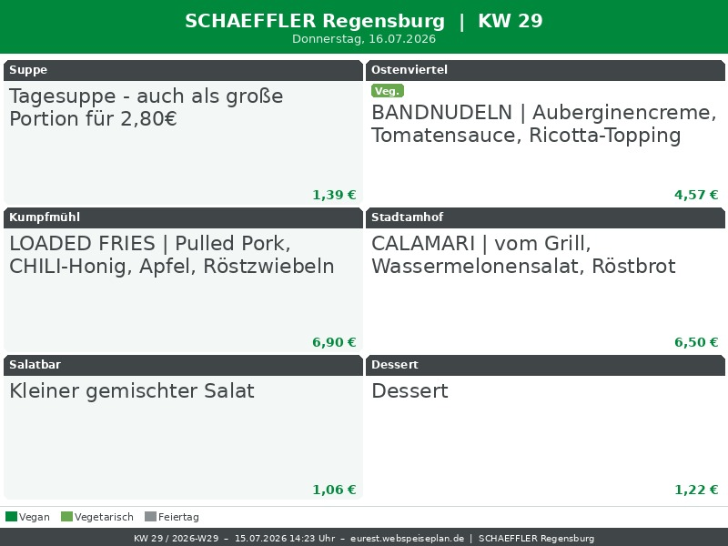
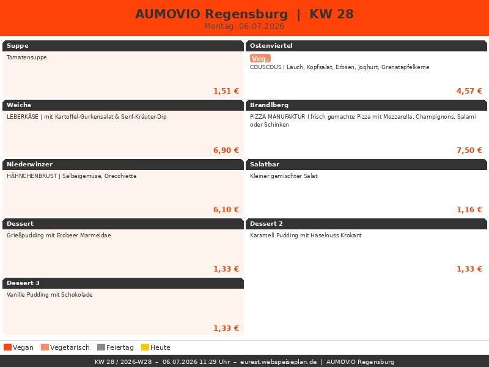

# Eurest Kantine Regensburg – Photoframe

> Automatischer Wochenmenü-Screenshot für den **Philips 8FF3WMI Bilderrahmen** (800 × 600 px).
> Unterstützte Kantinen: **SCHAEFFLER Regensburg (0967)** & **AUMOVIO Regensburg (1553)**

---

## Was macht dieses Projekt?

1. **Scrapen** – Ein Playwright-Script öffnet [eurest.webspeiseplan.de](https://eurest.webspeiseplan.de/39799C127F748D639984F4CDBEB44846), wählt die Kantine aus, bestätigt die Privacy-Policy, stellt die Sprache auf Deutsch und extrahiert strukturierte Menüdaten direkt aus dem DOM.
2. **Rendern** – Die Daten werden als 800 × 600 JPEG gerendert – optimiert für den Bilderrahmen.
3. **RSS-Feed** – Je Kantine wird ein RSS-Feed erzeugt, sodass der Bilderrahmen das aktuelle Bild via URL abrufen kann.
4. **GitHub Actions** – Der gesamte Ablauf ist vollständig automatisiert, beide Kantinen laufen parallel.

---

## Aktuelles Bild

### SCHAEFFLER Regensburg


### AUMOVIO Regensburg


---

## Hardware

| Philips 8FF3WMI Bilderrahmen | TP-Link Router (WLAN) |
|:---:|:---:|
|  |  |

- **Bilderrahmen:** Philips 8FF3WMI, 800 × 600 px, RSS-Feed-Unterstützung
- **Netzwerk:** Der Rahmen hängt per WLAN am TP-Link Router
- **Aktualisierung:** Das Bild wird täglich um 02:00 Uhr (deutsche Zeit) automatisch aktualisiert

---

## Automatischer Zeitplan

| Zeitpunkt | Uhrzeit (DE) | Aktion |
|-----------|-------------|--------|
| Täglich Mo–Do | 02:00 Uhr | Aktuelle Woche neu generieren (korrekter Tagesstatus) |
| Freitag | 14:00 Uhr | Nächste Woche vorabladen |
| Samstag & Sonntag | 10:00 Uhr | Nächste Woche |
| Manuell | jederzeit | Workflow Dispatch mit `week_offset` und `location` |

> Das Nachtupdate um 02:00 Uhr stellt sicher, dass vergangene Tage korrekt als „vergangen“ markiert sind und das Bild immer den aktuellen Stand widerspiegelt. Ab Freitag 14:00 Uhr ist die nächste Woche bereits verfügbar.

---

## Render-Details

- **Auflösung:** 800 × 600 px (JPEG, Qualität 92)
- **Kategorien:** Dynamisch aus dem DOM – z. B. Suppe, Ostenviertel, Kumpfmühl, Stadtamhof, Salatbar, Dessert
- **Badges:** Vegan, Vegetarisch (erkannt aus Gerichtsname und Feature-Icons)
- **Feiertage:** Bayerische Feiertage werden erkannt und angezeigt
- **Heute:** Aktueller Tag wird golden hervorgehoben
- **Vergangene Tage:** Werden grau ausgegraut
- **Einheitliche Schriftgröße** pro Zeile – alle Zellen haben dieselbe Schriftgröße
- **Preis:** Wird unten rechts in jeder Zelle angezeigt

---

## Verzeichnisstruktur

```
.github/
  workflows/
    screenshot.yml              # GitHub Actions Workflow (Matrix: schaeffler + aumovio)
scripts/
  take_screenshot.py            # Scraping + Rendering (Eurest-Flow)
  generate_rss.py               # RSS-Feed Generierung (je Kantine)
docs/
  images/
    latest_schaeffler.jpg       # Aktuellstes Bild Schaeffler
    latest_aumovio.jpg          # Aktuellstes Bild Aumovio
    kantine_YYYY-WNN_schaeffler.jpg   # Archiv Schaeffler (max. 8 Bilder)
    kantine_YYYY-WNN_aumovio.jpg      # Archiv Aumovio (max. 8 Bilder)
  feed_schaeffler.xml           # RSS-Feed Schaeffler (HTTPS)
  feed_schaeffler.php           # RSS-Feed Schaeffler (HTTP, bplaced, kein Cache)
  feed_aumovio.xml              # RSS-Feed Aumovio (HTTPS)
  feed_aumovio.php              # RSS-Feed Aumovio (HTTP, bplaced, kein Cache)
  index.html                    # Übersichtsseite (GitHub Pages)
sources/
  IMG/
    .gitkeep
```

---

## RSS-Feed für den Bilderrahmen

Der Bilderrahmen (Philips 8FF3WMI) kann einen RSS-Feed mit Bildern abonnieren.

### SCHAEFFLER Regensburg

**Feed-URL (HTTPS):**
```
https://raw.githubusercontent.com/basecore/eurest-kantine-photoframe/main/docs/feed_schaeffler.xml
```

**Feed-URL (HTTP, bplaced – kein Cache, für Philips Frame):**
```
http://basecore.bplaced.net/eurest/feed_schaeffler.php
```

Alternativ direkt das aktuelle Bild:
```
https://raw.githubusercontent.com/basecore/eurest-kantine-photoframe/main/docs/images/latest_schaeffler.jpg
```

### AUMOVIO Regensburg

**Feed-URL (HTTPS):**
```
https://raw.githubusercontent.com/basecore/eurest-kantine-photoframe/main/docs/feed_aumovio.xml
```

**Feed-URL (HTTP, bplaced – kein Cache, für Philips Frame):**
```
http://basecore.bplaced.net/eurest/feed_aumovio.php
```

Alternativ direkt das aktuelle Bild:
```
https://raw.githubusercontent.com/basecore/eurest-kantine-photoframe/main/docs/images/latest_aumovio.jpg
```

---

## Lokale Ausführung

### Voraussetzungen

```bash
pip install playwright Pillow
python -m playwright install chromium
sudo apt-get install -y fonts-dejavu fonts-liberation  # Linux
```

### Ausführen

```bash
# Schaeffler – nächste Woche (Standard)
EUREST_LOCATION_ID=8949 EUREST_LOCATION_NAME=schaeffler python scripts/take_screenshot.py

# Aumovio – nächste Woche
EUREST_LOCATION_ID=8950 EUREST_LOCATION_NAME=aumovio python scripts/take_screenshot.py

# Aktuelle Woche
WEEK_OFFSET=0 EUREST_LOCATION_ID=8949 EUREST_LOCATION_NAME=schaeffler python scripts/take_screenshot.py

# RSS-Feeds generieren
python scripts/generate_rss.py
```

Die Bilder werden unter `docs/images/kantine_YYYY-WNN_<location>.jpg` gespeichert.

---

## Umgebungsvariablen

| Variable | Standard | Beschreibung |
|----------|----------|--------------|
| `EUREST_LOCATION_ID` | `8949` | `8949` = Schaeffler, `8950` = Aumovio |
| `EUREST_LOCATION_NAME` | `schaeffler` | Kurzname für Dateinamen (`schaeffler` / `aumovio`) |
| `WEEK_OFFSET` | `1` | `0` = aktuelle Woche, `1` = nächste Woche |

> Kein GitHub Secret erforderlich – die Eurest-Seite ist öffentlich zugänglich.

---

## GitHub Pages aktivieren

```
Settings → Pages → Source: Deploy from branch → main → /docs
```

Dann erreichbar unter:
```
https://basecore.github.io/eurest-kantine-photoframe/
```

---

## Technische Details

### Scraping-Strategie (Eurest webspeiseplan)

Die Eurest-Seite erfordert einen mehrstufigen Initialisierungsflow vor dem eigentlichen Scraping:

| Schritt | Aktion |
|---------|--------|
| 1 | Mandanten-URL öffnen: `eurest.webspeiseplan.de/39799C127F748D639984F4CDBEB44846` |
| 2 | `locationSelection` auf `8949` (Schaeffler) oder `8950` (Aumovio) setzen |
| 3 | Privacy-Policy-Checkbox aktivieren + OK klicken |
| 4 | Sprache „Deutsch“ wählen + „Weiter“ klicken |
| 5 | Optionales Modal „persoenlicher Filter“ mit „Nein“ schließen |
| 6 | Pro Werktag: Tages-Button (`.dayBtn`) klicken, DOM extrahieren |

- **DOM-basiert:** Kategorien aus `.category-wrapper` → `.category-name-container`, Gerichte aus `.mealNameWrapper`, Preise aus `.price-value`, Vegan/Vegetarisch aus `.image-feature`-Icons
- **Dynamische Kategorien:** Die Kategorienamen (Suppe, Ostenviertel, Kumpfmühl, Stadtamhof, Salatbar, Dessert) werden direkt aus dem DOM gelesen – kein festes Mapping nötig
- **Matrix-Build:** Beide Kantinen laufen parallel als separate GitHub-Actions-Jobs

### Vergleich: Siemens vs. Eurest

| Merkmal | [siemens-kantine-photoframe](https://github.com/basecore/siemens-kantine-photoframe) | eurest-kantine-photoframe |
|---------|----------------------|---------------------------|
| Portal | siemens.cateringportal.io (Angular) | eurest.webspeiseplan.de (React) |
| Einstieg | Direkte URL mit Datum | Mandanten-URL + Kantine wählen |
| Kategorien | Fix: Suppe / E1 / E2 / E3 | Dynamisch aus DOM |
| Authentifizierung | Optional: Session-ID (Secret) | Keine |
| Kantinen | 1 (Siemens Regensburg) | 2 (Schaeffler + Aumovio) |
| Ausgabe | 1 Bild, 1 RSS-Feed | 2 Bilder, 2 RSS-Feeds |
| Actions-Jobs | 1 Job | 2 parallele Jobs (Matrix) |
